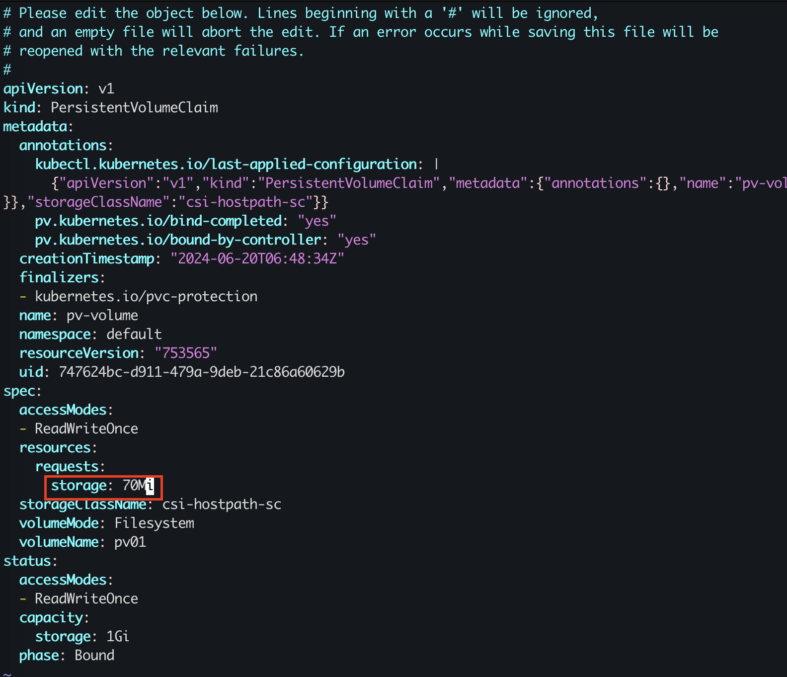

### 题目

设置配置环境：

    [candidate@node-1] $ kubectl config use-context ok8s

Task

创建一个新的 PersistentVolumeClaim：       
名称: pv-volume       
Class: csi-hostpath-sc      
容量: 10Mi        
创建一个新的 Pod，来将 PersistentVolumeClaim 作为 volume 进行挂载：     
名称：web-server       
Image：nginx:1.16        
挂载路径：/usr/share/nginx/html      
配置新的 Pod，以对 volume 具有 ReadWriteOnce 权限。     
最后，使用 kubectl edit 或 kubectl patch 将 PersistentVolumeClaim 的容量扩展为 70Mi，并记录此更改。

### 准备环境

考试时候无需，直接按照题目要求切换集群即可！！！

执行准备脚本

    bash ./env_setup.sh

### 答题

考点：pvc 的创建 class 属性的使用，--record 记录变更

注意：本题目和上一题PV没有任何关系！！！

参考链接：https://kubernetes.io/zh-cn/docs/tasks/configure-pod-container/configure-persistent-volume-storage/

#### 1. 切换环境

    kubectl config use-context ok8s

#### 2. 新建PVC yaml

    vim pvc.yaml

#### 3. 创建PVC

```
ubuntu@kubeworker01:/Users/yangyong/arch/cka/11-pvc$ k apply -f pvc.yaml
persistentvolumeclaim/pv-volume created
```

#### 4. 查看PVC，确保status为bound

```
ubuntu@kubeworker01:/Users/yangyong/arch/cka/11-pvc$ k get pvc
NAME        STATUS   VOLUME   CAPACITY   ACCESS MODES   STORAGECLASS      VOLUMEATTRIBUTESCLASS   AGE
pv-volume   Bound    pv01     1Gi        RWO            csi-hostpath-sc   <unset>                 40s
```

#### 5. 生成pod yaml文件

    k run web-server --image=nginx:1.16  --dry-run=client -o yaml > pod-pvc-draft.yaml

#### 6. 拷贝编辑pod-pvc.yaml

#### 7. 创建pod

     k apply -f pod-pvc.yaml

#### 8. 查看Pod

```
ubuntu@kubeworker01:/Users/yangyong/arch/cka/11-pvc$ k get pod web-server
NAME         READY   STATUS    RESTARTS   AGE
web-server   1/1     Running   0          10s
```

编辑pvc修改大小，注意修改位置！！！

    kubectl edit pvc pv-volume --record



注意：由于本地模拟环境不支持存储resize，这一步骤会失败，但考试环境没有问题！！！

```
code
```

### 验证

确保pvc 状态为Bound, POD状态为running