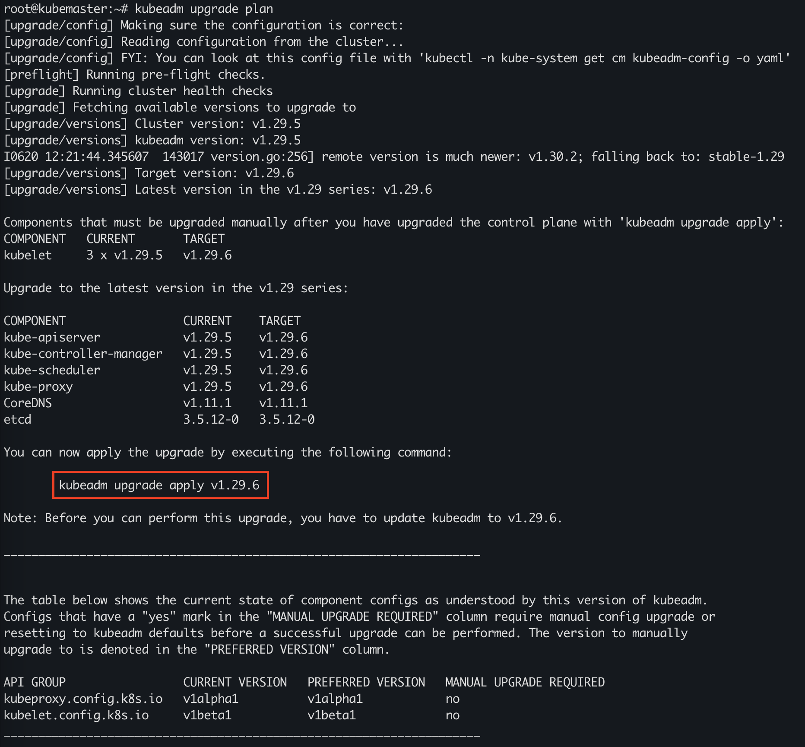

### 题目

设置配置环境：

    [candidate@node-1] $ kubectl config use-context mk8s

Task

现有的 Kubernetes 集群正在运行版本 1.29.5。仅将 master 节点上的所有 Kubernetes 控制平面和节点组件升级到版本 1.29.6。   
确保在升级之前 drain master 节点，并在升级后 uncordon master 节点。   
可以使用以下命令，通过 ssh 连接到 master 节点：

    ssh master01

可以使用以下命令，在该 master 节点上获取更高权限：

    sudo -i

另外，在主节点上升级 kubelet 和 kubectl。

请不要升级工作节点，etcd，container 管理器，CNI 插件， DNS 服务或任何其他插件。

### 准备环境

考试时候无需，直接按照题目要求切换集群即可！！！

执行准备脚本

    bash ./env_setup.sh

### 答题

注意，考试敲命令时，注意题目要求你升级的版本，根据题目要求输入正确的版本号！！！

比如考题是，正在运行的版本是 1.29.5，要求升级到 1.29.6，下面答案的命令也应该做相应的改变

参考链接： 没必要参考官网，建议多练习，背过命令就行。 记不清的，可以使用 kubectl -h 来帮助。

#### 1. 切换环境：

    kubectl config use-context mk8s

当前工作节点执行：

#### 2. cordon 停止调度，将 node 调为 SchedulingDisabled。新 pod 不会被调度到该 node，但在该 node 的旧 pod 不受影响

```
ubuntu@kubeworker01:~$ kubectl cordon kubemaster
node/kubemaster cordoned
```

#### 3. drain 驱逐节点。首先，驱逐该 node 上的 pod，并在其他节点重新创建。接着，将节点调为 SchedulingDisabled。

```
ubuntu@kubeworker01:~$ kubectl drain kubemaster --ignore-daemonsets
node/kubemaster already cordoned
Warning: ignoring DaemonSet-managed Pods: kube-system/kube-proxy-pcpsj, kube-system/weave-net-2rjnb
evicting pod kube-system/coredns-76f75df574-clm2m
evicting pod kube-system/coredns-76f75df574-5w2pr
pod/coredns-76f75df574-clm2m evicted
pod/coredns-76f75df574-5w2pr evicted
node/kubemaster drained
```

#### 4. ssh 到 master 节点，并切换到 root 下

#### 5. 更新 apt 仓库源

    apt-get update

#### 6. 获取具体版本号

通过下面命令，可以查出来具体要升级的版本号，包括后面的版本号数字。比如 1.28.1-00 1.29.1-1.1 等等。这样后续升级命令才能写出具体版本号数字

```
root@kubemaster:~# apt-cache show kubeadm|grep 1.29.6
Version: 1.29.6-1.1
Filename: arm64/kubeadm_1.29.6-1.1_arm64.deb

```

#### 7. 检查 kubeadm 升级后的版本

    kubeadm version

#### 8. 验证升级计划

    kubeadm upgrade plan

#### 9. 开始应用升级，安装题目要求的是 v1.29.6。升级时有提示，要输入 y。根据各自网络情况，大约要等 5 分钟。

    kubeadm upgrade apply v1.29.6 --etcd-upgrade=false

截图仅为示例，以考试要求版本为准！！！



#### 10. 升级 kubelet，注意，版本号数字，也要使用上面查到的

    apt-get install kubelet=1.29.6-1.1

#### 11. 重启 kubelet

    systemctl daemon-reload
    systemctl restart kubelet

#### 12. 切记，做完后，要退回到初始节点

    exit
    exit

#### 13. 恢复 master01 调度，这一步务必要做，否则前功尽弃

```
ubuntu@kubemaster:~$ kubectl uncordon kubemaster
node/kubemaster uncordoned
```

### 验证

检查 master01 是否为 Ready，并且为题目要求升级到的版本

    kubectl get node

查看版本

    kubelet --version