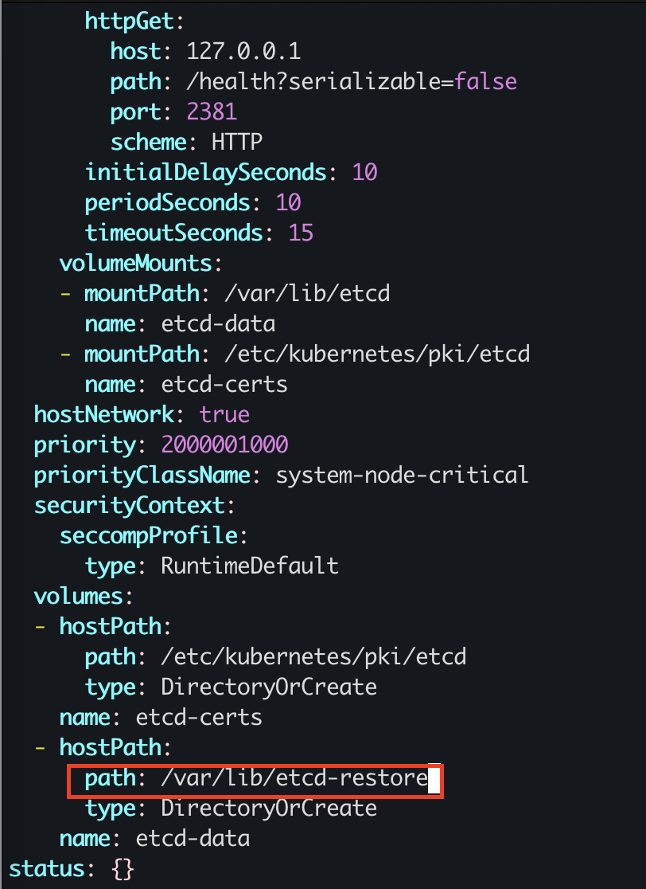

### 题目

设置配置环境：

    [candidate@node-1] $ kubectl config use-context xk8s

Task

您必须从 master01 主机执行所需的 etcdctl 命令。
首先，为运行在 https://127.0.0.1:2379 上的现有 etcd 实例创建快照并将快照保存到 /var/lib/backup/etcd-snapshot.db         
提供了以下 TLS 证书和密钥，以通过 etcdctl 连接到服务器。     
CA 证书: /opt/KUIN00601/ca.crt        
客户端证书: /opt/KUIN00601/etcd-client.crt       
客户端密钥: /opt/KUIN00601/etcd-client.key       
为给定实例创建快照预计能在几秒钟内完成。 如果该操作似乎挂起，则命令可能有问题。用 CTRL + C 来取消操作，然后重试。      
然后通过位于/data/backup/etcd-snapshot-previous.db 的先前备份的快照进行还原。

### 准备环境

考试时候无需，直接按照题目要求切换集群即可！！！

执行准备脚本

    bash ./env_setup.sh

### 答题

考点：etcd 的备份和还原命令

没必要参考官网，建议多练习，背过命令就行。
记不清的，可以使用 etcdctl -h 来帮助，更方便。

#### 1. 考试时务必执行，切换集群。模拟环境中不需要执行。

    kubectl config use-context xk8s

#### 2. ssh 到 master 节点，并切换到 root 下

    ssh master01
    sudo -i

#### 3. 备份：ETCDCTL_API=3 必须加，因为考试时，默认的 ETCDCTL_API 不是 3，所以执行命令会报错。所以必须指定 ETCDCTL_API=3

```
root@kubemaster:/opt/KUIN00601# ETCDCTL_API=3 etcdctl \ 
--endpoints=https://127.0.0.1:2379 \
--cacert="/opt/KUIN00601/ca.crt" \ 
--cert="/opt/KUIN00601/etcd-client.crt" \
--key="/opt/KUIN00601/etcd-client.key" 
snapshot save /var/lib/backup/etcd-snapshot.db
2024-06-20 11:16:18.448702 I | clientv3: opened snapshot stream; downloading
2024-06-20 11:16:18.627354 I | clientv3: completed snapshot read; closing
Snapshot saved at /var/lib/backup/etcd-snapshot.db
```

#### 4. 检查： （考试时，这些检查动作，都可以不做）

```
root@kubemaster:/opt/KUIN00601# ETCDCTL_API=3 etcdctl snapshot status /var/lib/backup/etcd-snapshot.db -wtable
+----------+----------+------------+------------+
|   HASH   | REVISION | TOTAL KEYS | TOTAL SIZE |
+----------+----------+------------+------------+
| daf30ff1 |   731240 |       1645 |      35 MB |
+----------+----------+------------+------------+
```

#### 5. 还原比较难，耗时也长，分值也低，风险还高。非老鸟，建议直接放弃还原这部分，应该只会扣 4 分的。

#### 6. 新建一个临时目录

    mkdir -p /opt/bak/

#### 7. 将/etc/kubernetes/manifests/kube-*文件移动到临时目录里

    mv /etc/kubernetes/manifests/kube-* /opt/bak/

#### 8. 需要指定 etcd 还原后的新数据目录，随便写一个系统里没有的目录，比如/var/lib/etcd-restore

```
root@kubemaster:/opt/KUIN00601# ETCDCTL_API=3 etcdctl --endpoints=127.0.0.1:2379 --data-dir=/var/lib/etcd-restore snapshot restore /data/backup/etcd-snapshot-previous.db
2024-06-20 11:37:41.504752 I | mvcc: restore compact to 731979
2024-06-20 11:37:41.523398 I | etcdserver/membership: added member 8e9e05c52164694d [http://localhost:2380] to cluster cdf818194e3a8c32
```

#### 9. 检查一下新目录，有数据了

```
root@kubemaster:/opt/KUIN00601# ls /var/lib/etcd-restore
member
```

#### 10. 修改 etcd 配置文件

    vim /etc/kubernetes/manifests/etcd.yaml



#### 11. 将临时目录的文件，移动回/etc/kubernetes/manifests/目录里

    mv /opt/bak/kube-* /etc/kubernetes/manifests/

#### 12. 重新加载配置

    systemctl daemon-reload

#### 13. 重启 kubelet

    systemctl restart kubelet

这里要注意，耐心等待，集群重启需要时间3分钟左右（控制面资源部署拉起也需要时间），如果还不行，就检查哪里配置错误！！！

### 验证

获取pod正常，说明已经正常恢复

```
ubuntu@kubemaster:~$ kubectl get pods
NAME                           READY   STATUS         RESTARTS   AGE
11-factor-app                  0/2     Error          0          3h41m
foo                            1/1     Running        0          7h25m
front-end-74858ddbbc-chw96     1/1     Running        0          14h
nginx-kusc00401                1/1     Running        0          9h
presentation-6f57ccbc7-4shvk   1/1     Running        0          114m
presentation-6f57ccbc7-6mtwc   1/1     Running        0          40h
```

可以不做，健康检查

```
root@kubemaster:/etc/kubernetes/pki/etcd# ETCDCTL_API=3 etcdctl --endpoints=https://localhost:2379 --cacert=/etc/kubernetes/pki/etcd/ca.crt --cert=/etc/kubernetes/pki/etcd/server.crt --key=/etc/kubernetes/pki/etcd/server.key  endpoint health
https://localhost:2379 is healthy: successfully committed proposal: took = 6.679025ms
```