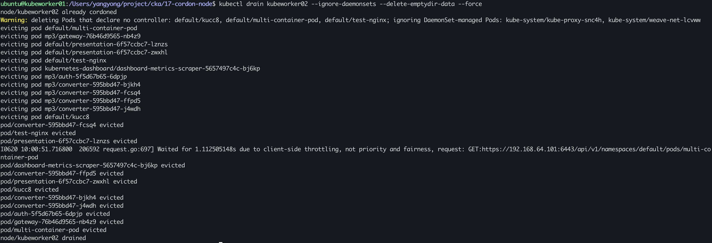
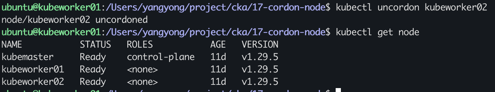

### 题目

设置配置环境：

    [candidate@node-1] $ kubectl config use-context ek8s

Task

将名为 node02 的 node 设置为不可用，并重新调度该 node 上所有运行的 pods。

### 准备环境

考试时候无需，直接按照题目要求切换集群即可！！！

执行准备脚本

    bash ./env_setup.sh

### 答题

考点：cordon 和 drain 命令的使用，先标记不可调度，再驱逐。

参考链接：https://kubernetes.io/zh-cn/docs/concepts/workloads/controllers/deployment/

#### 1. 先检查节点状态

```
ubuntu@kubeworker01:/Users/yangyong/arch/cka/17-cordon-node$ k get node
NAME           STATUS   ROLES           AGE   VERSION
kubemaster     Ready    control-plane   11d   v1.29.5
kubeworker01   Ready    <none>          11d   v1.29.5
kubeworker02   Ready    <none>          11d   v1.29.5
```

#### 2. 暂停节点 node02 调度

```
ubuntu@kubeworker01:/Users/yangyong/arch/cka/17-cordon-node$ k cordon kubeworker02
node/kubeworker02 cordoned
```

#### 3. 查看Node状态

```
ubuntu@kubeworker01:/Users/yangyong/arch/cka/17-cordon-node$ k get node
NAME           STATUS                     ROLES           AGE   VERSION
kubemaster     Ready                      control-plane   11d   v1.29.5
kubeworker01   Ready                      <none>          11d   v1.29.5
kubeworker02   Ready,SchedulingDisabled   <none>          11d   v1.29.5
```

#### 4. 驱逐节点 node02（因为 daemonsets 是无法驱逐的，所以要忽略它）

```
ubuntu@kubeworker01:/Users/yangyong/arch/cka/17-cordon-node$ kubectl drain kubeworker02 --ignore-daemonsets
node/kubeworker02 already cordoned
error: unable to drain node "kubeworker02" due to error:[cannot delete Pods with local storage (use --delete-emptydir-data to override): kubernetes-dashboard/dashboard-metrics-scraper-5657497c4c-bj6kp, cannot delete Pods declare no controller (use --force to override): default/kucc8, default/multi-container-pod, default/test-nginx], continuing command...
There are pending nodes to be drained:
 kubeworker02
cannot delete Pods with local storage (use --delete-emptydir-data to override): kubernetes-dashboard/dashboard-metrics-scraper-5657497c4c-bj6kp
cannot delete Pods declare no controller (use --force to override): default/kucc8, default/multi-container-pod, default/test-nginx
```

注意，如果执行上面驱逐命令，有下图这样的报错，无法驱逐，则需要加上 --delete-emptydir-data --force 参数

```
ubuntu@kubeworker01:/Users/yangyong/arch/cka/17-cordon-node$ kubectl drain kubeworker02 --ignore-daemonsets --delete-emptydir-data --force
node/kubeworker02 already cordoned
Warning: deleting Pods that declare no controller: default/kucc8, default/multi-container-pod, default/test-nginx; ignoring DaemonSet-managed Pods: kube-system/kube-proxy-snc4h, kube-system/weave-net-lcvww
evicting pod default/multi-container-pod
evicting pod mp3/gateway-76b46d9565-nb4z9
evicting pod default/presentation-6f57ccbc7-lznzs
evicting pod default/presentation-6f57ccbc7-zwxhl
evicting pod default/test-nginx
evicting pod kubernetes-dashboard/dashboard-metrics-scraper-5657497c4c-bj6kp
evicting pod mp3/auth-5f5d67b65-6dpjp
evicting pod mp3/converter-595bbd47-bjkh4
evicting pod mp3/converter-595bbd47-fcsq4
evicting pod mp3/converter-595bbd47-ffpd5
evicting pod mp3/converter-595bbd47-j4wdh
evicting pod default/kucc8
pod/converter-595bbd47-fcsq4 evicted
pod/test-nginx evicted
pod/presentation-6f57ccbc7-lznzs evicted
I0620 10:00:51.716800  206592 request.go:697] Waited for 1.112505148s due to client-side throttling, not priority and fairness, request: GET:https://192.168.64.101:6443/api/v1/namespaces/default/pods/multi-container-pod
pod/dashboard-metrics-scraper-5657497c4c-bj6kp evicted
pod/converter-595bbd47-ffpd5 evicted
pod/presentation-6f57ccbc7-zwxhl evicted
pod/kucc8 evicted
pod/converter-595bbd47-bjkh4 evicted
pod/converter-595bbd47-j4wdh evicted
pod/auth-5f5d67b65-6dpjp evicted
pod/gateway-76b46d9565-nb4z9 evicted
pod/multi-container-pod evicted
node/kubeworker02 drained
```

截图如下：


### 验证

无需验证。在测试环境需要恢复Node可调度

