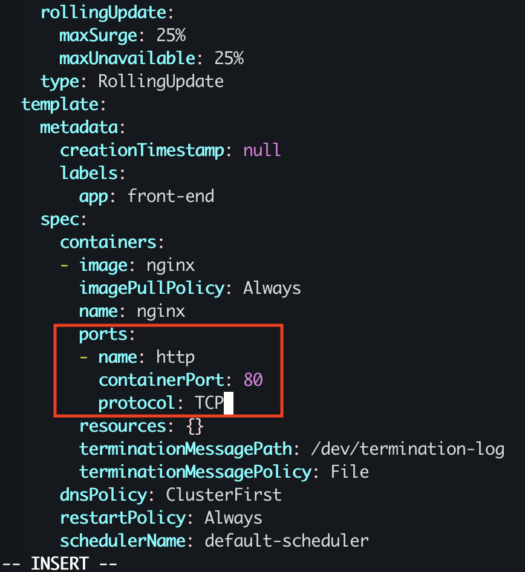

### 题目

设置配置环境：

    [candidate@node-1] $ kubectl config use-context k8s

Task

请重新配置现有的 deployment front-end 以及添加名为 http 的端口规范来公开现有容器 nginx 的端口 80/tcp。
创建一个名为 front-end-svc 的新 service，以公开容器端口 http。
配置此 service，以通过各个 Pod 所在的节点上的 NodePort 来公开他们。

### 准备环境

考试时候无需，直接按照题目要求切换集群即可！！！

执行准备脚本

    bash ./env_setup.sh

### 答题

考点：将现有的 deploy 暴露成 nodeport 的 service。

参考链接：https://kubernetes.io/zh-cn/docs/concepts/workloads/controllers/deployment/

#### 1. 编辑deploy，增加ports部分：

```
ubuntu@kubeworker01:/Users/yangyong/project/cka/4-expose-service$ k edit deploy front-end
deployment.apps/front-end edited
```

注意修改部分如下图所示：



#### 2. 暴露对应端口

注意考试中需要创建的是 NodePort，还是 ClusterIP。如果是 ClusterIP，则应为--type=ClusterIP
--port 是 service 的端口号，--target-port 是 deployment 里 pod 的容器的端口号。

```
ubuntu@kubeworker01:/Users/yangyong/project/cka/4-expose-service$ k expose deploy front-end --type=NodePort --port=80 --name=front-end-svc
service/front-end-svc exposed
```

### 验证

```
ubuntu@kubeworker01:/Users/yangyong/project/cka/4-expose-service$ k get svc front-end-svc -o wide
NAME            TYPE       CLUSTER-IP       EXTERNAL-IP   PORT(S)        AGE     SELECTOR
front-end-svc   NodePort   10.104.106.175   <none>        80:32280/TCP   6m52s   app=front-end
ubuntu@kubeworker01:/Users/yangyong/project/cka/4-expose-service$ curl 10.104.106.175:80
<!DOCTYPE html>
<html>
<head>
<title>Welcome to nginx!</title>
<style>
html { color-scheme: light dark; }
body { width: 35em; margin: 0 auto;
font-family: Tahoma, Verdana, Arial, sans-serif; }
</style>
</head>
<body>
<h1>Welcome to nginx!</h1>
<p>If you see this page, the nginx web server is successfully installed and
working. Further configuration is required.</p>

<p>For online documentation and support please refer to
<a href="http://nginx.org/">nginx.org</a>.<br/>
Commercial support is available at
<a href="http://nginx.com/">nginx.com</a>.</p>

<p><em>Thank you for using nginx.</em></p>
</body>
</html>
```