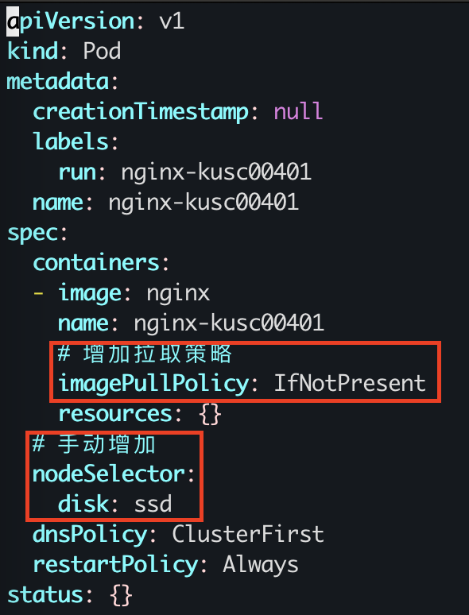

### 题目

设置配置环境：

    candidate@node-1] $ kubectl config use-context k8s

Task

按如下要求调度一个 pod：
名称：nginx-kusc00401      
Image：nginx     
Node selector：disk=ssd

### 准备环境

考试时候无需，直接按照题目要求切换集群即可！！！

执行准备脚本

    bash ./env_setup.sh

### 答题

考点：nodeSelect 属性的使用

https://kubernetes.io/zh-cn/docs/tasks/configure-pod-container/assign-pods-nodes/

#### 1. 先检查一下是否有这个 pod，因为没有创建，所以需要创建。

    kubectl get pod -A|grep nginx-kusc00401

#### 2. 检查一下 node 的标签，考试环境和模拟环境，都已经提前设置好 labels 了。

```
ubuntu@kubeworker01:/Users/yangyong/arch/cka/7-pod-schedule$ kubectl get nodes --show-labels | grep 'disk=ssd'
kubeworker01   Ready    <none>          10d   v1.29.5   beta.kubernetes.io/arch=arm64,beta.kubernetes.io/os=linux,disk=ssd,kubernetes.io/arch=arm64,kubernetes.io/hostname=kubeworker01,kubernetes.io/os=linux
```

#### 3. 创建pod yaml

    k run nginx-kusc00401 --image=nginx  --dry-run=client -o yaml > pod-disk-ssd-draft.yaml

#### 4. 拷贝并编辑pod-disk-ssd.yaml:

    cp pod-disk-ssd-draft.yaml pod-disk-ssd.yaml

注意修改部分如下图所示：



#### 5. 创建POD

    k apply -f pod-disk-ssd.yaml

### 验证

检查

```
ubuntu@kubeworker01:/Users/yangyong/arch/cka/7-pod-schedule$ k get pod nginx-kusc00401
NAME              READY   STATUS    RESTARTS   AGE
nginx-kusc00401   1/1     Running   0          114s
```